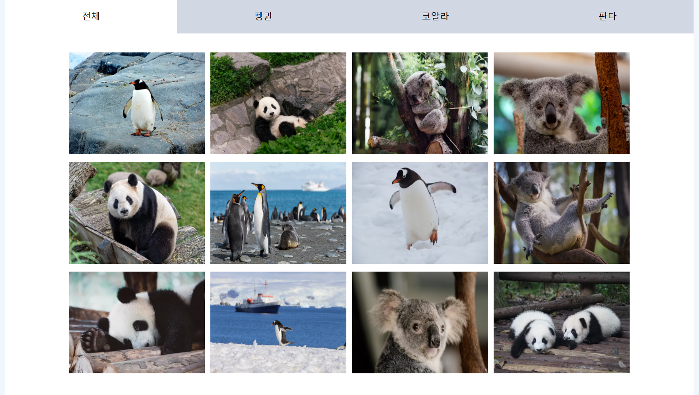

# 📸 동물 앨범 만들기

####  API로 동물 사진을 불러와서 보여주는 웹 사이트 ( 한 번에 끝내는 자바스크립트 중간과제 )로, 총 *3단계*를 통해서 웹 기능을 *upgrade* 시킴  
   
  

### ✔ 1단계
####  ▶ 바닐라 자바스크립트로 웹 페이지 만들기   
  * 필요한 모든 파일을 만들어줌   

    * tab별로 총 4개의 html, js파일 만듦     
 * 문제점    
    * 중복코드
   * 페이지 이동시마다 계속 새로운 파일을 불러와야함 => 화면 깜박거림 발생, 렌더링 느림     
     
### ✔ 2단계   
#### ▶ 상태 관리와 SPA   
  * 중복코드는 component로 묶어주기   
  * 최상위 app.js에서 각 모듈을 import 하고 상태관리 해줌    
      * 상태관리 : 상태를 효율적으로 관리하는 것으로, 변경된 부분만 바꾸므로 불필요한 리렌더링을 막음 => 성능 향상     
         * React와 비슷하게 state와 setState 사용   
          * state : 변화하는 데이터  

### ✔ 3단계   
#### ▶ 라우팅 기능 추가  
* 라우팅 : 웹사이트 내에서 웹주소 URL을 특정 페이지에 연결하는 과정으로 페이지 이동 시, 요청한 페이지를 반환하고 URL뒤에 주소가 변경된다 

* history API 사용   
  
   * 바닐라 자바스크립트는 자체적으로 제공하는 라우팅이 없으므로 history API 사용   
  * history 전역 객체를 통해 브라우저 `세션 히스토리(현재 페이지가 로드된 탭 또는 방문한페이지)`에 대한 접근을 제공한다. 이를 통해 방문기록을 앞 뒤로 탐색할 수 있다.    
  ```
  history.back(); //방문 기록 뒤로 이동
  history.forward(); // 방문 기록 앞으로 이동

  //브라우저 세션 기록에 항목 추가
  history.pushState(state,title,URL);

  //popstate 이벤트
  window.addEventListener("popstate",(e)=>{})
  //=>뒤로가기,앞으로 가기 등의 이벤트로 히스토리 API를 통해 브라우저 히스토리가 변경될 때마다 발생함
  //=>팝스테이트 이벤트가 발생하면 주소의 슬래시 뒤쪽에 작성된 값에 알맞은 스테이트를 업데이트 해주어야 함
  
 * express로 기본적인 웹 서버 설정 및 라우팅 오류 수정   
  * =>node.js의 기능을 확장해서 더욱 간결하고 효율적으로 웹서버를 개발할 수 있게 도와주는 프레임워크로  라우팅, 요청 처리, 응답관리를 쉽게 처리할 수 있다